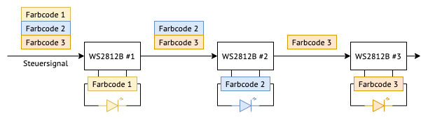
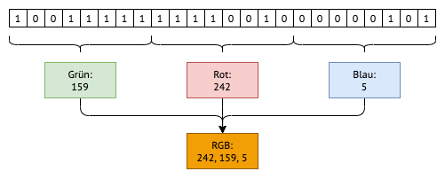
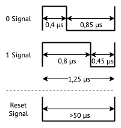

# Stadion-Anzeigetafel

## Steuerung der Anzeige

Die Anzeige besteht aus einer LED-Matrix mit etwa 1000 RGB LEDs. Die LEDs sind in Reihen auf LED-Streifen angebracht. Jede einzelne RGB LED besteht aus drei kleinen LEDs in den Farben Rot, Grün und Blau. Durch Kombination der einzelnen Farb-LEDs kann ein breites Farbspektrum erzeugt werden.

### WS2812B RGB LED Streifen

Auf den LED-Streifen sind WS2812B ICs angebracht, die die einzelnen LEDs steuern. Alle ICs sind in Reihe geschaltet. Vom Mikrocontroller werden nacheinander die Farbcodes für die einzelnen LEDs gesendet.

Der erste Chip empfängt das Steuersignal und verarbeitet den ersten Farbcode. Daraufhin enterfernt der IC den ersten Farbcode aus dem Steuersignal und gibt das resultierene Signal an die folgenden Chips weiter.
Die nächsten ICs wiederholen das Vorgehen. Somit wird das Steuersignal von Chip zu Chip kürzer, bis es den letzten Chip erreicht. Am Ende des Steuersignals wird ein Reset-Signal gesendet.

Abbildung: Ablauf der WS2812B Steuerung

### Benötigte Signale

Jeder Farbcode besteht aus 24 Bit beziehungsweise 3 Byte. In jedem Byte ist die Intensität einer Farbe enthalten. Im ersten Byte ist der Grünwert, im zweiten der Rotwert und im dritten Byte der Blauwert kodiert. Daraus entstehen drei Werte, die von 0 bis 256 reichen. Diese ergeben den RGB-Wert der LED.

Abbildung: Aufbau eines Farbcodes

Die 24 Bit je Farbcode werden elektrisch über ein Datenkabel an die Chips gesendet. Die Spannung auf dem Kabel wird entweder auf "high" oder "low" gesetzt (3,3 V oder 0 V). Je nachdem, wie lange das Signal im Zustand "high" und "low" verbringt, wird es als "0" oder "1" interpretiert. Die genauen Zeitverhältnisse sind in folgender Abbildung dargestellt.

Abbildung: Timing der Signale

Die Periode für das Senden einer 0/1-Signals beträgt 1,25µs. Die high/low-Signale haben eine Toleranz von ±150 ns.

Nachdem die Farbcodes aller LEDs gesendet wurden, folgt ein Reset-Signal. Dazu wird die Datenleitung für mindestens 50 µs auf "low" gebracht.

### Erzeugung der Signale

### Double Buffering
